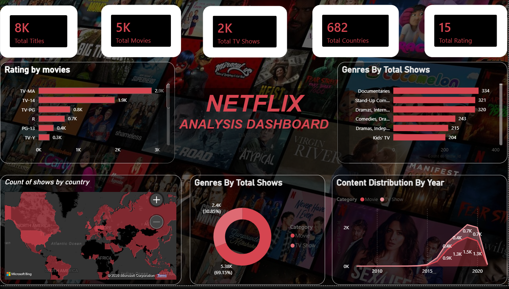

# 🎬 Netflix Analysis Dashboard — Power BI

## 📊 Project Overview

This project is an **interactive Netflix Analysis Dashboard built using Microsoft Power BI**.
The dashboard analyzes Netflix movies and TV shows to understand content distribution, ratings, genres, countries, and yearly trends.

The project demonstrates practical skills in **Data Cleaning, Data Analysis, Data Visualization, Power BI, DAX, and Dashboard Development**.

---

## 🎯 Project Objectives

The main objectives of this project are:

* Analyze the total number of Netflix titles.
* Compare **Movies vs TV Shows**.
* Analyze content distribution by year.
* Identify popular genres.
* Analyze Netflix content ratings.
* Understand content availability across different countries.
* Create an interactive and easy-to-understand business dashboard.

---

## 🛠️ Tools & Technologies

* **Microsoft Power BI**
* **Power Query**
* **DAX**
* **Microsoft Excel**
* **Data Cleaning**
* **Data Visualization**
* **Dashboard Design**

---

## 📌 Key KPIs

| KPI                | Value |
| ------------------ | ----: |
| 🎬 Total Titles    |    8K |
| 🎥 Total Movies    |    5K |
| 📺 Total TV Shows  |    2K |
| 🌍 Total Countries |   682 |
| ⭐ Total Ratings    |    15 |

---

## 📈 Dashboard Features

### 1. Rating Analysis

The dashboard shows the distribution of Netflix movies across different ratings such as:

* TV-MA
* TV-14
* TV-PG
* R
* PG-13
* TV-Y

**TV-MA** represents the largest share among the displayed movie ratings.

### 2. Genre Analysis

The dashboard analyzes the number of shows available across different genres.

Some of the major genres shown include:

* Documentaries
* Stand-Up Comedy
* Dramas
* International Dramas
* Comedies
* Independent Movies
* Kids' TV

### 3. Country Analysis

A world map visual is used to analyze the **count of Netflix shows by country**.

This helps identify countries with a larger presence of Netflix content.

### 4. Movie vs TV Show Distribution

A donut chart provides a comparison between Movies and TV Shows.

* Movies: approximately **69%**
* TV Shows: approximately **31%**

### 5. Content Distribution by Year

A time-series visualization shows how Netflix content has changed over the years.

This helps understand the growth and distribution of Movies and TV Shows over time.

---

## 🔄 Data Preparation Process

The dataset was prepared using **Power Query** before creating the dashboard.

### Data Cleaning Steps

1. Imported Netflix dataset into Power BI.
2. Checked column names and data types.
3. Removed unnecessary/duplicate records where required.
4. Handled missing values.
5. Cleaned text-based fields.
6. Prepared categorical columns for analysis.
7. Created required calculated columns/measures.
8. Loaded the cleaned data into the Power BI model.

---

## 🧮 DAX & Analysis

DAX measures were used to calculate important KPIs and support dashboard analysis.

Examples of analytical calculations include:

* Total Titles
* Total Movies
* Total TV Shows
* Total Countries
* Total Ratings
* Movie vs TV Show percentage
* Genre-wise content count
* Rating-wise content count

---

## 📷 Dashboard Preview



---

## 📁 Project Structure

```text
Netflix-PowerBI-Dashboard/
│
├── Netflix_Dashboard.pbix
├── Netflix_Dataset.xlsx
├── Netflix.png
└── README.md
```

### Files Description

| File                     | Description               |
| ------------------------ | ------------------------- |
| `Netflix_Dashboard.pbix` | Power BI dashboard file   |
| `Netflix_Dataset.xlsx`   | Dataset used for analysis |
| `Netflix.png`            | Dashboard preview         |
| `README.md`              | Project documentation     |

---

## 🚀 How to Use This Project

1. Download or clone this repository.
2. Open `Netflix_Dashboard.pbix` using **Microsoft Power BI Desktop**.
3. If required, update the dataset/file path.
4. Refresh the data.
5. Explore the dashboard and visuals.

---

## 💡 Key Insights

Based on the dashboard:

* Netflix contains significantly more **Movies than TV Shows**.
* **TV-MA** is the highest displayed rating category.
* **Documentaries** are among the leading genres in the dataset.
* Netflix content is distributed across a large number of countries.
* The content distribution shows significant growth in the later years of the dataset.
* Movies account for approximately **69%** of the analyzed content, while TV Shows account for approximately **31%**.

---

## 💼 Skills Demonstrated

This project demonstrates the following Data Analyst skills:

**Excel | Power BI | Power Query | DAX | Data Cleaning | Data Transformation | Data Visualization | KPI Development | Dashboard Design | Data Analysis | Business Insights**

---

## 👨‍💻 Author

**Nikhil Vishwakarma**

Aspiring **Data Analyst**

Skills:
**SQL | Excel | Power BI | Python | MySQL | Data Cleaning | Data Visualization | DAX**

---

## ⭐ Project Purpose

This project was created as a **Data Analytics portfolio project** to demonstrate practical experience in transforming raw data into an interactive Power BI dashboard and extracting meaningful business insights.
